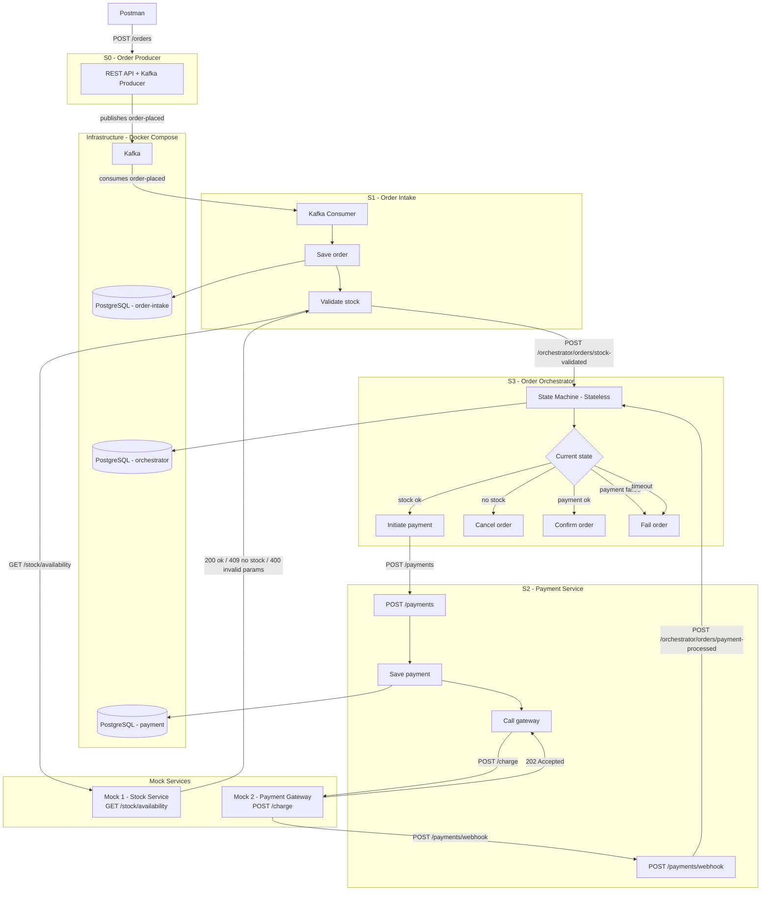
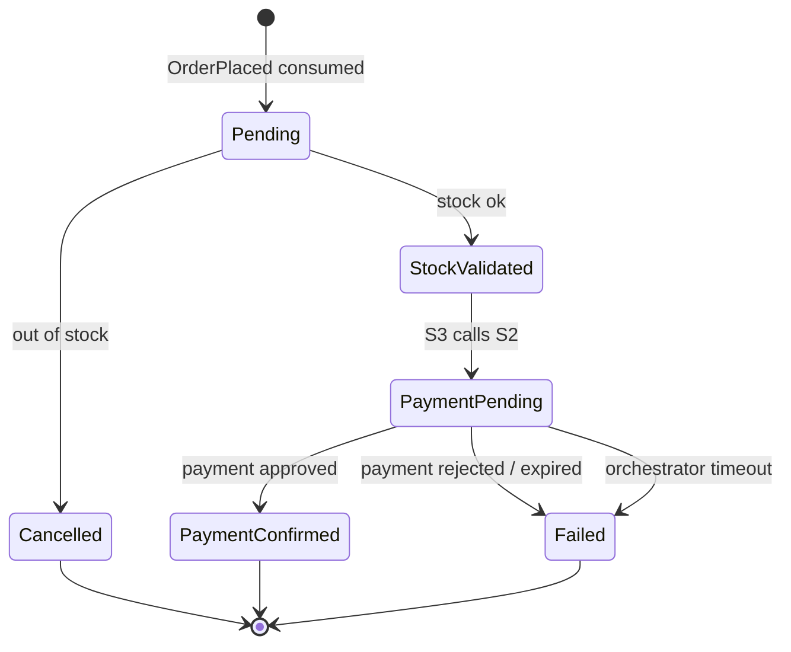

# Order Processing System — Architecture

---

## 1. System Services

| # | Name | Responsibility | ORM | Incoming | Outgoing |
|---|---|---|---|---|---|
| **S0** | Order Producer | REST API + Kafka Producer. Manual entry from Postman | - | HTTP (Postman) | Kafka → order-placed |
| **S1** | Order Intake | Kafka Consumer. Saves order, validates stock, notifies orchestrator | EF Core | Kafka ← order-placed | HTTP → Stock Mock, HTTP → S3 |
| **S2** | Payment Service | REST API. Receives payment request, calls gateway, receives webhook, notifies orchestrator | Dapper | HTTP (S3), HTTP /webhook (Gateway Mock) | HTTP → Gateway Mock, HTTP → S3 |
| **S3** | Order Orchestrator | REST API + Stateless. Orchestrates full order lifecycle | Dapper | HTTP (S1), HTTP (S2) | HTTP → S2 |
| **Mock 1** | Stock Service | Simple REST API. Simulates stock validation | - | HTTP (S1) | HTTP response → S1 |
| **Mock 2** | Payment Gateway | Simple REST API. Simulates async payment gateway with webhook | - | HTTP (S2) | HTTP 202 → S2, HTTP /webhook → S2 |

---

## 2. Service Analysis

### S0 — Order Producer
Manual entry point to the system. Allows injecting orders from Postman for development and testing.

- Exposes `POST /orders`
- Receives an order payload and publishes it to the `order-placed` Kafka topic
- No database
- The only service whose sole purpose is to produce Kafka messages
- Owner of `totalAmount`: calculates and sends the amount; downstream services do not recalculate it

### S1 — Order Intake
Responsible for receiving and validating orders arriving via Kafka.

- Consumes the `order-placed` topic
- Persists the full order in PostgreSQL using **EF Core**
- Synchronously calls the Stock Service Mock to validate availability of each item
- Notifies the Orchestrator via HTTP with the validation result, including `totalAmount` and `currency` as orchestration context

### S2 — Payment Service
Responsible for payment processing. Acts as an intermediary between the Orchestrator and the external payment gateway.

- Exposes `POST /payments` to receive requests from the Orchestrator
- Receives `orderId`, `totalAmount` and `currency` from the Orchestrator
- Persists the payment request in PostgreSQL using **Dapper**
- Calls the Payment Gateway Mock asynchronously
- Exposes `POST /payments/webhook` to receive the gateway response
- Notifies the Orchestrator via HTTP once the response is received

### S3 — Order Orchestrator
The brain of the system. Orchestrates the full order lifecycle using a state machine.

- Exposes HTTP endpoints to receive notifications from S1 and S2
- Implements the state machine using **Stateless**
- Persists each order's state in PostgreSQL using **Dapper**
- Transports `orderId`, `totalAmount` and `currency` as orchestration context (it carries them, it does not own them)
- Coordinates the call to S2 when appropriate
- Handles timeouts (payment not confirmed within 5 minutes → Failed)
- Background polling job checks for expired sagas every 30 seconds

### Mock 1 — Stock Service
Simulates an external stock validation service.

- Exposes `GET /stock/availability?productId={id}&quantity={qty}`
- Response codes:
  - `200 OK` → stock available
  - `409 Conflict` → out of stock
  - `400 Bad Request` → invalid or malformed parameters
  - `500 Internal Server Error` → internal error
- Configurable behavior via `POST /config/stock`:

```json
{
  "response": 200
}
```
`response`: `200` (available), `409` (out of stock), `400` (invalid params), `500` (error).

### Mock 2 — Payment Gateway
Simulates a real payment gateway with asynchronous behavior.

- Exposes `POST /charge` to receive payment requests
- Configurable immediate response codes:
  - `202 Accepted` → request accepted, will process asynchronously
  - `400 Bad Request` → invalid payment data
  - `422 Unprocessable Entity` → insufficient funds (immediate rejection)
  - `500 Internal Server Error` → gateway internal error
- After a configurable delay, calls S2's webhook with the result
- Configurable webhook result: `approved`, `rejected` (with reason), `expired`
- Configurable via `POST /config/payment-gateway`:

```json
{
  "immediateResponse": 202,
  "webhookDelayMs": 3000,
  "webhookResult": "rejected",
  "webhookReason": "insufficient_funds"
}
```

---

## 3. Flow Diagram



---

## 4. State Machine Diagram



---

## 5. Domain Events and HTTP Contracts

### Design decisions
- **Fat Events**: events carry all necessary information. Consumers do not need to query the source.
- **Format**: plain JSON, no Schema Registry.
- **Common envelope**: all Kafka events share the same base structure.
- **Price ownership**: S0 owns `totalAmount`. Downstream services do not recalculate or verify prices.
- **Orchestration context**: S3 transports `orderId`, `totalAmount` and `currency` without owning that data.

### Mock Configuration (quick reference)

Both mocks expose a `POST /config` endpoint that replaces in-memory configuration.
Each test gets its own mock instance (Testcontainers for integration, sequential for E2E).

**Stock Mock:**
```json
POST /config/stock
{
  "response": 200
}
```
`response`: `200` (available), `409` (out of stock), `400` (invalid params), `500` (error).

**Payment Gateway Mock:**
```json
POST /config/payment-gateway
{
  "immediateResponse": 202,
  "webhookDelayMs": 3000,
  "webhookResult": "approved",
  "webhookReason": null
}
```
`immediateResponse`: `202`, `400`, `422` or `500`.
`webhookResult`: `approved`, `rejected` or `expired`.

### Common Envelope (Kafka events)

```json
{
  "eventId": "uuid-v7",
  "eventType": "OrderPlaced",
  "occurredAt": "2024-01-15T10:30:00Z",
  "version": 1,
  "payload": { }
}
```

### Event 1 — `OrderPlaced`
- **Published by:** S0
- **Consumed by:** S1
- **Kafka topic:** `order-placed`

### Dead Letter Queue — `order-placed-dlq`
- **Published by:** S1 (on processing failure)
- **Consumed by:** S1 DLQ monitor consumer (logs only)
- **Kafka topic:** `order-placed-dlq`
- **Design decision**: Messages that cannot be processed are never silently dropped. They are routed to the DLQ immediately (no retry) for deserialization errors, validation errors, and duplicate orders. Transient errors are routed after Polly retries are exhausted. A monitoring consumer logs each DLQ entry for alerting. The DLQ envelope (`DlqMessage`) includes: `originalMessage`, `errorType`, `errorDetail`, `failedAt`, `retryCount`, `sourceService`.
- **Error types**: `DeserializationError`, `ValidationError`, `DuplicateOrder`, `TransientError`.

```json
{
  "eventId": "018e5e23-...",
  "eventType": "OrderPlaced",
  "occurredAt": "2024-01-15T10:30:00Z",
  "version": 1,
  "payload": {
    "orderId": "018e5e24-...",
    "customerId": "018e5e25-...",
    "customerEmail": "john@example.com",
    "shippingAddress": {
      "street": "742 Evergreen Terrace",
      "city": "Springfield",
      "country": "US",
      "zipCode": "12345"
    },
    "items": [
      {
        "productId": "018e5e26-...",
        "productName": "Laptop Pro 15",
        "quantity": 1,
        "unitPrice": 999.99,
        "currency": "USD"
      }
    ],
    "totalAmount": 999.99,
    "currency": "USD"
  }
}
```

### Notification 1 — Stock Validated
- **Sent by:** S1 → S3
- **Endpoint:** `POST /orchestrator/orders/stock-validated`

```json
{
  "orderId": "018e5e24-...",
  "stockValidated": true,
  "totalAmount": 999.99,
  "currency": "USD",
  "items": [
    {
      "productId": "018e5e26-...",
      "quantityRequested": 1,
      "stockAvailable": true
    }
  ],
  "occurredAt": "2024-01-15T10:30:01Z"
}
```

When `stockValidated` is `false`, at least one item has `stockAvailable: false`.

### Notification 2 — Payment Processed
- **Sent by:** S2 → S3
- **Endpoint:** `POST /orchestrator/orders/payment-processed`

```json
{
  "orderId": "018e5e24-...",
  "paymentId": "018e5e27-...",
  "status": "approved",
  "reason": null,
  "amount": 999.99,
  "currency": "USD",
  "occurredAt": "2024-01-15T10:30:45Z"
}
```

`status`: `approved`, `rejected` or `expired`. `reason` applies when `rejected` (e.g. `insufficient_funds`, `card_expired`).

### Payment Request
- **Sent by:** S3 → S2
- **Endpoint:** `POST /payments`

```json
{
  "orderId": "018e5e24-...",
  "amount": 999.99,
  "currency": "USD"
}
```

---

## 6. State Machine

### States

| State | Description | Ball is at |
|---|---|---|
| `Pending` | Order received, waiting for stock validation | S1 |
| `StockValidated` | Stock confirmed, waiting for S3 to initiate payment | S3 |
| `Cancelled` | Insufficient stock, order cancelled | Terminal |
| `PaymentPending` | Payment initiated, waiting for S2 response | S2 |
| `PaymentConfirmed` | Payment approved, order complete | Terminal |
| `Failed` | Payment rejected, expired, or orchestrator timeout | Terminal |

### Transitions

| From | Trigger | To |
|---|---|---|
| `Pending` | S1 notifies stock ok | `StockValidated` |
| `Pending` | S1 notifies out of stock | `Cancelled` |
| `StockValidated` | S3 calls S2 successfully | `PaymentPending` |
| `PaymentPending` | S2 notifies payment approved | `PaymentConfirmed` |
| `PaymentPending` | S2 notifies payment rejected or expired | `Failed` |
| `PaymentPending` | Orchestrator timeout | `Failed` |

---

## 7. Technology Stack

| Layer | Technology | Reason |
|---|---|---|
| **Framework** | .NET 8 LTS | Stable, long-term support |
| **Kafka client** | Confluent.Kafka | Official client with custom abstraction layer |
| **State machine** | Stateless | Focused, lightweight, teaches the pure pattern |
| **ORM (S1)** | Entity Framework Core | Rich domain, change tracking, automatic migrations |
| **ORM (S2, S3)** | Dapper | SQL control, performance, simplicity |
| **Database** | PostgreSQL | One engine, three databases (one per service) |
| **Architecture** | Clean Architecture + CQRS | Clear structure, separation of concerns |
| **Domain** | Pragmatic DDD | Value Objects, Entities, Aggregates, Domain Events |
| **Mediator** | Mediator (MIT community fork, martinothamar) | Implements CQRS in .NET. MediatR requires a paid commercial license since v12.4.0; Mediator is the MIT-licensed community fork with a compatible API and source-generator-based implementation for better performance. |
| **Validation** | FluentValidation | Expressive rules, testable in isolation, Mediator pipeline |
| **Error handling** | Global middleware + ProblemDetails | RFC 7807 standard, clean controllers |
| **Logging** | .NET native logger + OpenTelemetry | Structured logging, OTLP export, Aspire dashboard integration |
| **Observability** | OpenTelemetry (traces, metrics, logs) | OTLP exporter to Aspire Dashboard (or any OTLP-compatible backend). Instrumentation via `OpenTelemetry.Instrumentation.AspNetCore` and `OpenTelemetry.Instrumentation.Http`. |
| **IDs** | UUID v7 (UUIDNext) | Chronologically ordered, optimized for PostgreSQL indexes |
| **Local dev** | .NET Aspire | Dashboard, traces, logs, metrics for all services |
| **Message broker** | Apache Kafka (KRaft mode) | No ZooKeeper needed — KRaft is Kafka's built-in consensus mechanism, activated via environment variables |
| **Infrastructure** | Docker Compose | E2E tests and CI |
| **Unit tests** | xUnit + FluentAssertions + NSubstitute | .NET standard stack |
| **Integration tests** | xUnit + WebApplicationFactory + Testcontainers | Real infrastructure in Docker |
| **E2E tests** | xUnit + HttpClient | Against Docker Compose |
| **HTTP mocks (tests)** | WireMock.NET | Simulates external HTTP services in integration tests |
| **Resilience** | Polly (Microsoft.Extensions.Http.Resilience) | Retry with exponential backoff + circuit breaker on all outbound HTTP calls |
| **Repository** | Mono-repo | Single repo, single .sln, single docker-compose.yml |

### Kafka — KRaft mode

Kafka runs in **KRaft** (Kafka Raft) mode — the built-in consensus mechanism that replaces ZooKeeper. No additional `zookeeper` container is needed.

The single Kafka node acts as both **broker and controller** simultaneously. Two listeners are configured:
- **Internal listener** — used by services inside the Docker network to produce/consume messages.
- **Host listener** — used by the host machine (e.g. for local testing with `dotnet run`).

KRaft requires a fixed `CLUSTER_ID` to be set. This is a one-time random value generated at cluster creation time.

### Future upgrade
- **Inter-service communication (v1):** HTTP direct (S1→S3, S2→S3).
- **Inter-service communication (v2):** Kafka events — full decoupling between services.

---

## 8. Folder Structure

### Design decisions
- **Mono-repo**: single Git repository, one `.sln`, one `docker-compose.yml`.
- **Clean Architecture** for S1, S2, S3: rich domain, infrastructure abstractions, clear use cases.
- **Minimal structure** for S0 and Mocks: no domain, no complex use cases.
- **Dependency rule**: Domain defines contracts (interfaces). Infrastructure implements them. Application uses them. No one depends outward.

### Repository (mono-repo)

```
order-processing-system/
├── docker-compose.yml
├── order-processing-system.sln
├── CLAUDE.md
├── ARCHITECTURE.md
│
├── src/
│   ├── OrderProducer/                 ← minimal structure
│   ├── OrderIntake/                   ← Clean Architecture
│   ├── PaymentService/                ← Clean Architecture
│   ├── OrderOrchestrator/             ← Clean Architecture
│   ├── Mocks/
│   │   ├── StockService/              ← minimal structure
│   │   └── PaymentGateway/            ← minimal structure
│   ├── Shared/                        ← shared contracts (events, DTOs)
│   └── AppHost/                       ← .NET Aspire orchestration
│
└── tests/
    ├── OrderIntake.UnitTests/
    ├── OrderIntake.IntegrationTests/
    ├── PaymentService.UnitTests/
    ├── PaymentService.IntegrationTests/
    ├── OrderOrchestrator.UnitTests/
    ├── OrderOrchestrator.IntegrationTests/
    └── E2E/
```

### Internal structure — Domain-rich services (S1, S2, S3)

Using **OrderIntake** as example. All domain-rich services follow the same pattern.

```
OrderIntake/
├── OrderIntake.Api/                   ← HTTP entry point, DI configuration
│   ├── Program.cs
│   ├── appsettings.json
│   └── Dockerfile
│
├── OrderIntake.Application/           ← use cases, commands, queries
│   ├── Commands/
│   │   └── ProcessOrder/
│   │       ├── ProcessOrderCommand.cs
│   │       └── ProcessOrderCommandHandler.cs
│   ├── Queries/
│   │   └── GetOrder/
│   │       ├── GetOrderQuery.cs
│   │       └── GetOrderQueryHandler.cs
│   └── Interfaces/                    ← ports (contracts defined by the app)
│       ├── IOrderRepository.cs        ← Infrastructure must implement this
│       └── IStockServiceClient.cs     ← Infrastructure must implement this
│
├── OrderIntake.Domain/                ← core, zero external dependencies
│   ├── Entities/
│   │   └── Order.cs                   ← encapsulated business rules
│   ├── ValueObjects/
│   │   ├── Money.cs
│   │   ├── Address.cs
│   │   └── OrderLine.cs
│   ├── Events/
│   │   └── OrderValidatedEvent.cs
│   ├── Exceptions/
│   │   └── DomainException.cs
│   └── Enums/
│       └── OrderStatus.cs
│
└── OrderIntake.Infrastructure/        ← concrete implementations (adapters)
    ├── Kafka/
    │   ├── KafkaConsumer.cs            ← implements IEventConsumer
    │   └── KafkaConsumerConfig.cs
    ├── Persistence/
    │   ├── OrderDbContext.cs
    │   ├── Repositories/
    │   │   └── OrderRepository.cs     ← implements IOrderRepository
    │   └── Migrations/
    └── HttpClients/
        └── StockServiceClient.cs      ← implements IStockServiceClient
```

### Internal structure — Simple services (S0, Mocks)

```
OrderProducer/
├── Program.cs
├── appsettings.json
├── Dockerfile
├── Controllers/
│   └── OrdersController.cs
└── Kafka/
    └── OrderProducer.cs

StockService/                          ← same structure for PaymentGateway
├── Program.cs
├── appsettings.json
├── Dockerfile
└── Controllers/
    ├── StockController.cs
    └── ConfigController.cs            ← POST /config/stock
```

### Shared project

Contains contracts shared across services. No business logic.

```
Shared/
├── Events/
│   └── OrderPlacedEvent.cs            ← Kafka event envelope + payload
└── Contracts/
    ├── StockValidatedNotification.cs  ← S1 → S3
    ├── PaymentProcessedNotification.cs ← S2 → S3
    └── InitiatePaymentRequest.cs      ← S3 → S2
```

---

## 9. Data Model

### Design decisions
- **One table per entity/relevant collection**: natural for relational databases, flexible queries, widely understood.
- **Address as Owned Entity** (EF Core): the `Address` value object is mapped as columns in the `orders` table. Reflects DDD, avoids unnecessary JOINs for a 1-to-1 relationship.
- **Timeout via polling**: a background job in S3 queries every 30 seconds for sagas in `PaymentPending` whose `timeout_at` has passed. Simple, no extra infrastructure, auto-recovers on service restart.
- **Payment timeout**: 5 minutes from payment initiation.

### S1 — order-intake-db (EF Core)

```sql
orders (
  id                  UUID          PK,
  status              VARCHAR(50)   NOT NULL,
  customer_id         UUID          NOT NULL,
  customer_email      VARCHAR(255)  NOT NULL,
  total_amount        DECIMAL(18,2) NOT NULL,
  currency            VARCHAR(3)    NOT NULL,
  shipping_street     VARCHAR(255)  NOT NULL,
  shipping_city       VARCHAR(100)  NOT NULL,
  shipping_country    VARCHAR(2)    NOT NULL,
  shipping_zip_code   VARCHAR(20)   NOT NULL,
  created_at          TIMESTAMPTZ   NOT NULL,
  updated_at          TIMESTAMPTZ   NOT NULL
)

order_lines (
  id                  UUID          PK,
  order_id            UUID          FK → orders.id,
  product_id          UUID          NOT NULL,
  product_name        VARCHAR(255)  NOT NULL,
  quantity            INT           NOT NULL,
  unit_price          DECIMAL(18,2) NOT NULL,
  currency            VARCHAR(3)    NOT NULL
)
```

**Notes:**
- `shipping_*` columns are the `Address` value object mapped as an EF Core Owned Entity.
- `order_lines` represents the `OrderLine` value object collection inside the `Order` aggregate.

### S2 — payment-db (Dapper)

```sql
payments (
  id                  UUID          PK,
  order_id            UUID          NOT NULL UNIQUE,
  status              VARCHAR(50)   NOT NULL,
  amount              DECIMAL(18,2) NOT NULL,
  currency            VARCHAR(3)    NOT NULL,
  rejection_reason    VARCHAR(100)  NULL,
  gateway_response    VARCHAR(50)   NULL,
  created_at          TIMESTAMPTZ   NOT NULL,
  updated_at          TIMESTAMPTZ   NOT NULL
)
```

**Notes:**
- `order_id` is `UNIQUE`: one order has exactly one payment.
- `rejection_reason` only has a value when `status` is `rejected`.
- `gateway_response` stores the raw gateway response for traceability.

### S3 — orchestrator-db (Dapper)

```sql
order_sagas (
  id                   UUID          PK,
  order_id             UUID          NOT NULL UNIQUE,
  current_state        VARCHAR(50)   NOT NULL,
  total_amount         DECIMAL(18,2) NOT NULL,
  currency             VARCHAR(3)    NOT NULL,
  payment_id           UUID          NULL,
  payment_initiated_at TIMESTAMPTZ   NULL,
  timeout_at           TIMESTAMPTZ   NULL,
  created_at           TIMESTAMPTZ   NOT NULL,
  updated_at           TIMESTAMPTZ   NOT NULL
)
```

**Notes:**
- `current_state` reflects the current state machine state.
- `total_amount` and `currency` are orchestration context transported to call S2.
- `payment_id` is populated when S3 calls S2. Used to correlate the callback notification.
- `timeout_at` is calculated when entering `PaymentPending`: `payment_initiated_at + 5 minutes`.
- Background polling query:

```sql
SELECT * FROM order_sagas
WHERE current_state = 'PaymentPending'
AND timeout_at < NOW()
```

---

## 10. .NET Aspire

.NET Aspire is the local development orchestrator. It replaces manual Docker Compose management during development and provides a built-in observability dashboard.

### What it does
- Starts all .NET services automatically
- Spins up PostgreSQL and Kafka in Docker
- Provides a dashboard at `http://localhost:15888` with:
  - Real-time logs from all services (centralized)
  - Distributed traces (OpenTelemetry) — see a full request flow across all services
  - Metrics per service

### AppHost configuration

```csharp
// src/AppHost/Program.cs
var builder = DistributedApplication.CreateBuilder(args);

var postgres = builder.AddPostgres("postgres");
var kafka = builder.AddKafka("kafka");

var orderIntake = builder.AddProject<Projects.OrderIntake_Api>("order-intake")
    .WithReference(postgres)
    .WithReference(kafka);

var paymentService = builder.AddProject<Projects.PaymentService_Api>("payment-service")
    .WithReference(postgres);

var orchestrator = builder.AddProject<Projects.OrderOrchestrator_Api>("order-orchestrator")
    .WithReference(postgres);

builder.Build().Run();
```

### Aspire vs Docker Compose

| | Aspire | Docker Compose |
|---|---|---|
| **Use case** | Local development | E2E tests and CI |
| **Dashboard** | Included | No |
| **Distributed traces** | Built-in (OpenTelemetry) | Manual setup |
| **Configuration** | C# typed | YAML |
| **Requires .NET** | Yes | No |

Both coexist: Aspire for development, Docker Compose for automated testing.

### Resilience — Polly

All outbound HTTP calls in S1, S2, and S3 are protected by Polly resilience pipelines via `Microsoft.Extensions.Http.Resilience`.

- **Retry policy**: 3 attempts, exponential backoff (2s, 4s, 8s), on transient errors (5xx, `HttpRequestException`). Status codes that indicate a permanent client error (400, 409, 422) are excluded from retries.
- **Circuit breaker**: opens after 5 consecutive failures within 30 seconds, stays open for 30 seconds before attempting half-open.
- **TODO**: Implement the Outbox Pattern for messages that cannot be delivered after all retries are exhausted.

| Service | HTTP Client | Non-retried statuses |
|---|---|---|
| S1 | StockServiceClient | 400, 409 |
| S1 | OrchestratorClient | — |
| S2 | PaymentGatewayClient | 400, 422 |
| S2 | OrchestratorClient | — |
| S3 | PaymentServiceClient | — |

### Observability — OpenTelemetry

All services export traces, metrics, and logs via the **OpenTelemetry Protocol (OTLP)** to the Aspire Dashboard (or any OTLP-compatible backend such as Jaeger, Grafana, or Seq).

- **Signal types**: Traces (distributed request tracing), Metrics (throughput, latency), Logs (structured log lines with trace correlation).
- **Instrumentation**: ASP.NET Core (`AddAspNetCoreInstrumentation`) and HttpClient (`AddHttpClientInstrumentation`) are auto-instrumented.
- **Exporter configuration**: Set the `OTEL_EXPORTER_OTLP_ENDPOINT` environment variable. The OpenTelemetry SDK reads this automatically. In Docker Compose: `http://aspire-dashboard:18889`.
- **Service names**: `order-producer`, `order-intake`, `payment-service`, `order-orchestrator`, `stock-service`, `payment-gateway`.
- **Docker Compose**: The `aspire-dashboard` service is included and listens on port `18888` (UI) and `4317`/`18889` (OTLP gRPC).

---

## 11. .NET 8 Optimizations

These optimizations are applied across the project to improve performance, reduce boilerplate, and follow .NET 8 best practices.

| Optimization | Applies to | Reason |
|---|---|---|
| **Logging Source Generators** | All services | Compile-time log methods, zero runtime overhead, type-safe parameters |
| **JSON Source Generators** | Kafka serialization, HTTP contracts | Compile-time serialization, no reflection, AOT compatible |
| **Primary Constructors** | Handlers, services, repositories | Less boilerplate, .NET 8 standard |
| **Records** | Value objects, commands, queries, DTOs | Immutability, value equality, less code |
| **Minimal APIs** | S0 and Mocks | Simplicity for small services with few endpoints |
| **IExceptionHandler** | S1, S2, S3 | Official .NET 8 pattern for global error handling |
| **Keyed Services** | IEventConsumer | Multiple implementations resolvable by key (useful for tests) |

### Logging Source Generators
```csharp
public static partial class OrderLogMessages
{
    [LoggerMessage(Level = LogLevel.Information,
        Message = "Order {OrderId} validated with status {Status}")]
    public static partial void OrderValidated(
        this ILogger logger, Guid orderId, string status);
}
// Usage: _logger.OrderValidated(orderId, status);
```

### JSON Source Generators
```csharp
[JsonSerializable(typeof(OrderPlacedEvent))]
[JsonSerializable(typeof(StockValidatedNotification))]
[JsonSerializable(typeof(InitiatePaymentRequest))]
public partial class AppJsonContext : JsonSerializerContext { }
// Usage: JsonSerializer.Deserialize(json, AppJsonContext.Default.OrderPlacedEvent);
```

### Primary Constructors
```csharp
public class ProcessOrderCommandHandler(
    IOrderRepository repository,
    IStockServiceClient stockClient,
    ILogger<ProcessOrderCommandHandler> logger)
    : IRequestHandler<ProcessOrderCommand>
{
    // repository, stockClient, logger available directly
}
```

### Records
```csharp
public record Money(decimal Amount, string Currency);
public record ProcessOrderCommand(Guid OrderId, string CustomerEmail, Money Total) : IRequest;
public record CreateOrderResponse(Guid OrderId, string Status);
```

### IExceptionHandler (.NET 8)
```csharp
public class GlobalExceptionHandler(ILogger<GlobalExceptionHandler> logger) : IExceptionHandler
{
    public async ValueTask<bool> TryHandleAsync(HttpContext context, Exception exception, CancellationToken ct)
    {
        var (status, title) = exception switch
        {
            DomainException => (400, "Domain rule violation"),
            NotFoundException => (404, "Resource not found"),
            _ => (500, "An unexpected error occurred")
        };
        logger.LogError(exception, "Unhandled exception: {Title}", title);
        await context.Response.WriteAsJsonAsync(
            new ProblemDetails { Status = status, Title = title }, ct);
        return true;
    }
}
```

### Keyed Services
```csharp
builder.Services.AddKeyedScoped<IEventConsumer, KafkaConsumer>("kafka");
builder.Services.AddKeyedScoped<IEventConsumer, InMemoryConsumer>("inmemory");
// Resolution: public class OrderProcessor([FromKeyedServices("kafka")] IEventConsumer consumer)
```

---

## 12. Next Steps

### Design
- [x] Define system services
- [x] Analyze responsibilities of each service
- [x] Define technology stack
- [x] Define domain events and HTTP contracts
- [x] Define state machine and transitions
- [x] Define folder structure
- [x] Define data model per service

### Setup
- [ ] Create .NET solution and projects in mono-repo
- [ ] Configure Docker Compose (Kafka + PostgreSQL)
- [ ] Configure .NET Aspire AppHost
- [ ] Create `CLAUDE.md` with Claude Code context

### Implementation
- [ ] Implement S0 — Order Producer
- [ ] Implement Mock 1 — Stock Service
- [ ] Implement Mock 2 — Payment Gateway
- [ ] Implement S1 — Order Intake
- [ ] Implement S2 — Payment Service
- [ ] Implement S3 — Order Orchestrator

### Testing
- [ ] Unit tests per service
- [ ] Integration tests per service
- [ ] E2E tests for the full flow

### Upgrade
- [ ] Migrate HTTP communication (S1→S3, S2→S3) to Kafka events
